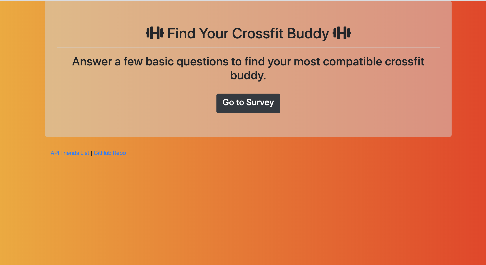
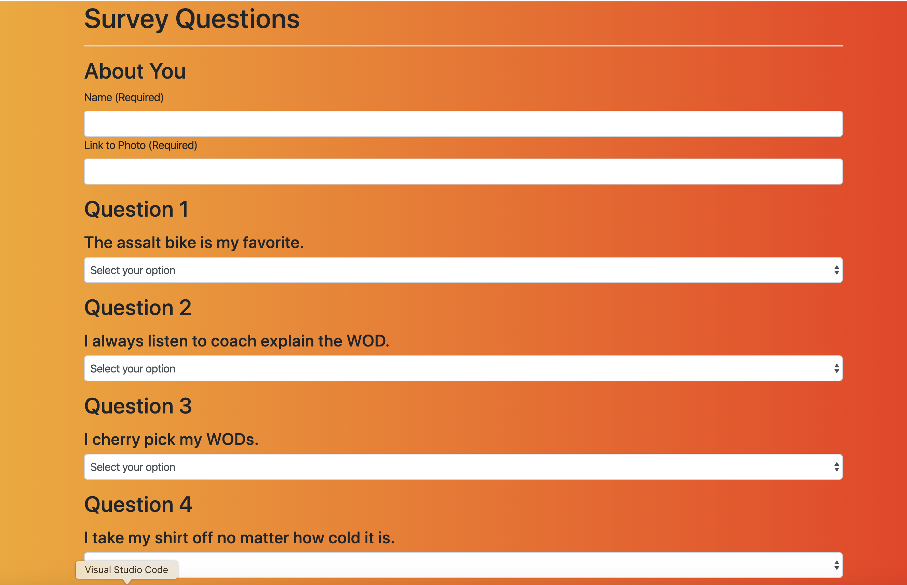
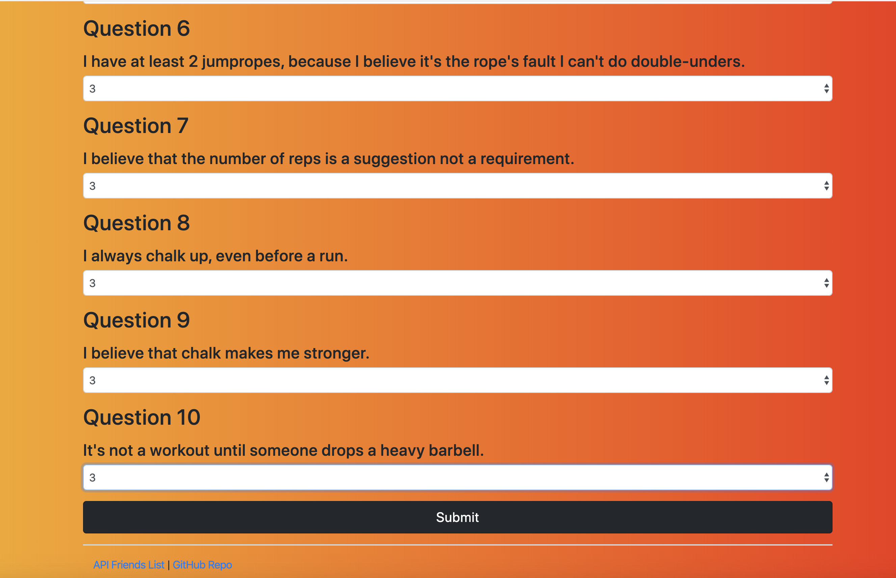
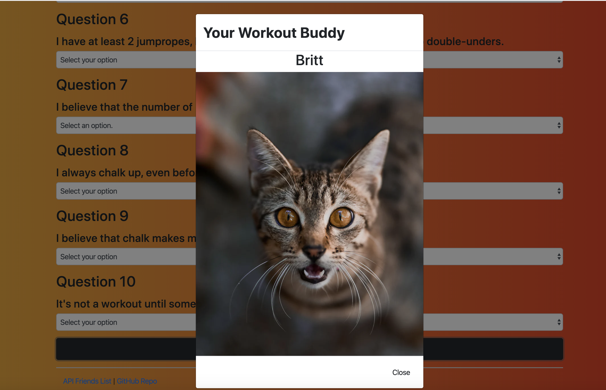

# FriendFinder App
```
A match application using Javascript, Express and Node servers.
```

## Deployed on Heroku 


## Tools Used: 

  * Node.js 
  * Express NPM
    * (https://www.npmjs.com/package/express)
  * Body-Parser NPM
    * (https://www.npmjs.com/package/body-parser)
  * Javascript/ JQuery 
  * JSON
  * Bootstrap 
  * Google Fonts
  * Font Awesome
  * CSS/HTML

## HOW IT WORKS

### Click ```START``` to Access Survey





### Complete Survey

* User must complete survey fully. 
* Rank each statement on a scale of 1-5.
* If user leaves a field empty, they will be prompted to complete all fields. 
* 10 Questions in Total.



### Click ```SUMBIT``` to See Your Match



* After "SUBMIT" is clicked a modal will display with the friend's name and photo from API that best matches the users preferences.



## Acknowledgments

* Photos from [Unsplash](https://unsplash.com/)
* Background from [uiGradients](https://uigradients.com/)
